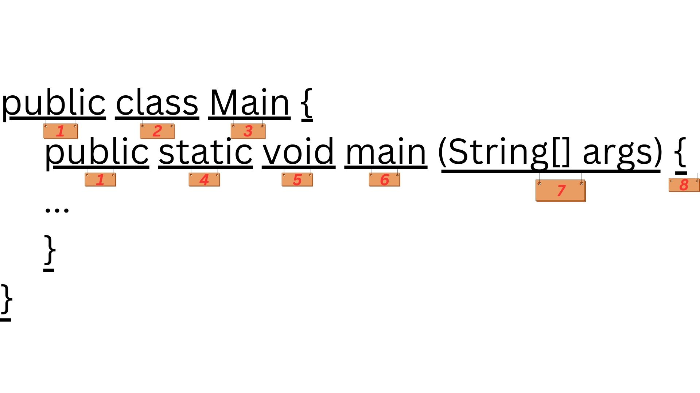

# Mission-Java

<strong>&#x26A0; Warning: This is my personal project for learning Java. So don't bother me.</strong> <br>

<details>
  <summary>Starting code of a java file</summary>

```java

public class Main{
  public static void main(String[] args){
    ...
  }
}

```
  <details>
  <summary>explanation</summary>
  
  <br>

  1. All classes and functions/methods have an access modifier. Access modifier determines if other classes and methods can access this class or method. ex: public, private...
  2. What type of value will the function return, like: a number, true or false etc... <br>
     *If the function does not return anything, the return type will be "void".
  3. Name of the class. <br>
     *Every function needs to be inside of a class called "Main".
  4. ...
  5. What type of value will the function return, like: a number, true or false etc... <br>
     *If the function does not return anything, the return type will be "void".
  6. Name of the function.(could be anything) <br>
     *Every java code should have at least on function/method "main".
  7. Parentheses(প্রথম বন্ধনী): Used to add parameters for the function, parameters to pass values to the function. Like how to do execute the function.
  8. Pair of curly braces. Inside these curls braces we write out actual java code.
  9. "String[] args" - ...
  </details>
</details>
<br>

<h3>Learning Progress:</h3>

<details>
  <summary>Variables</summary>
  There are 2 types of variables, Primitive types and Reference types.

  Primitive type example: 

  ```java
  int name = 60;
  ```

Reference type example: 

```java
Date name = new Date();
```

  <br>
  <div>
    <table>
      <thead>
        <tr>
          <th><strong>Feature</strong></th>
          <th><strong>Primitive Types</strong></th>
          <th><strong>Reference Types</strong></th>
        </tr>
      </thead>
      <tbody>
        <tr>
          <td><strong>Definition</strong></td>
          <td>Basic data types provided by Java</td>
          <td>Objects and arrays that refer to memory locations</td>
        </tr>
        <tr>
          <td><strong>Examples</strong></td>
          <td><code>int</code>, <code>char</code>, <code>float</code>, <code>boolean</code></td>
          <td><code>String</code>, <code>Arrays</code>, <code>Objects</code></td>
        </tr>
        <tr>
          <td><strong>Memory Allocation</strong></td>
          <td>Stored in stack memory</td>
          <td>Stored in heap memory</td>
        </tr>
        <tr>
          <td><strong>Data Stored</strong></td>
          <td>Directly contains the value <br> *independent of each other</td>
          <td>Contains the memory address (reference) <br> *not independent</td>
        </tr>
        <tr>
          <td><strong>Performance</strong></td>
          <td>Faster due to direct value access</td>
          <td>Slower due to reference handling</td>
        </tr>
        <tr>
          <td><strong>Default Value</strong></td>
          <td>Type-specific default (e.g., <code>0</code>, <code>false</code>)</td>
          <td><code>null</code></td>
        </tr>
        <tr>
          <td><strong>Size</strong></td>
          <td>Fixed size (e.g., <code>int</code> is 4 bytes)</td>
          <td>Varies based on object size</td>
        </tr>
        <tr>
          <td><strong>Nullability</strong></td>
          <td>Cannot be <code>null</code></td>
          <td>Can be <code>null</code></td>
        </tr>
      </tbody>
    </table>
  </div>
</details>
