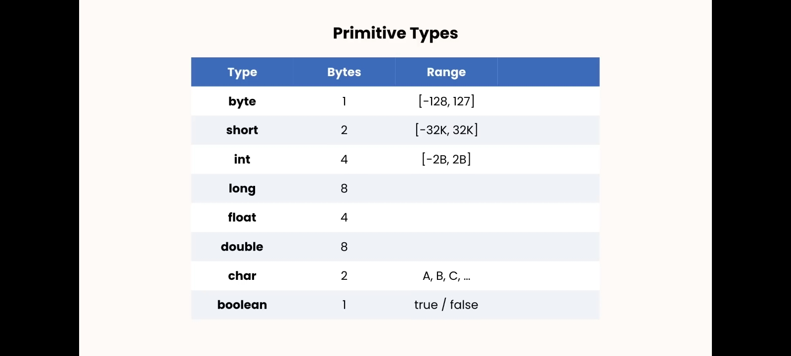

# Mission-Java

<strong>&#x26A0; Warning: This is my personal project for learning Java. So don't bother me.</strong>
<br>

<details>
<summary>Starting code of a java file</summary>
  
```java

public class Main{
  public static void main(String[] args){

  }
}

```
  <details>
  <summary>explanation</summary>
  
  <br>
    
  1. All classes and functions/methods have an access modifier. Access modifier determines if other classes and methods can access this class or method. ex: public, private...
  2. What type of value will the function return, like: a number, true or false etc... <br>
     *If the function does not return anything, the return type will be "void".
  3. Name of the class. <br>
     *Every function needs to be inside of a class called "Main".
  4. ...
  5. What type of value will the function return, like: a number, true or false etc... <br>
      *If the function does not return anything, the return type will be "void".
  6. Name of the function.(could be anything) <br>
     *Every java code should have at least on function/method "main".
  7. Parentheses(প্রথম বন্ধনী): Used to add parameters for the function, parameters to pass values to the function. Like how to do execute the function.
  8. Pair of curly braces. Inside these curls braces we write out actual java code.
  9. "String[] args" - ...
  </details>
</details>
<br>

<h3>Learning Progress:</h3>

<details>
  <summary>Different types of "Variables" 1</summary>
1. Primitive types, to store simple values<br>
  <br>
  <details> <summary>example:</summary>
    
```java

public class Main {
  public static void main(String[] args) {

    int age = 30

  }
}

```
</details>

2. Reference types, to store complex objects<br>
  
  <details> <summary>example:</summary>
    
```java

public class Main {
  public static void main(String[] args) {
    Date now = new Date();
    now.getTime();
  }
}

```
</details>
